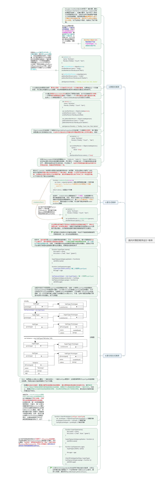

### 面向对象的程序设计（核心整理）  
注：此整理摘自JavaScript高级程序设计（第3版）。  
#### * 创建对象（一）  
  
#### * 创建对象（二）
注：至此面向对象的程序设计之创建对象已整理完毕。  
  
#### * 继承（一）  
注：此次只整理了前三种继承方式，后续有另三种  
  
#### * 继承（二）  
至此面向对象的程序设计之继承整理完毕  
